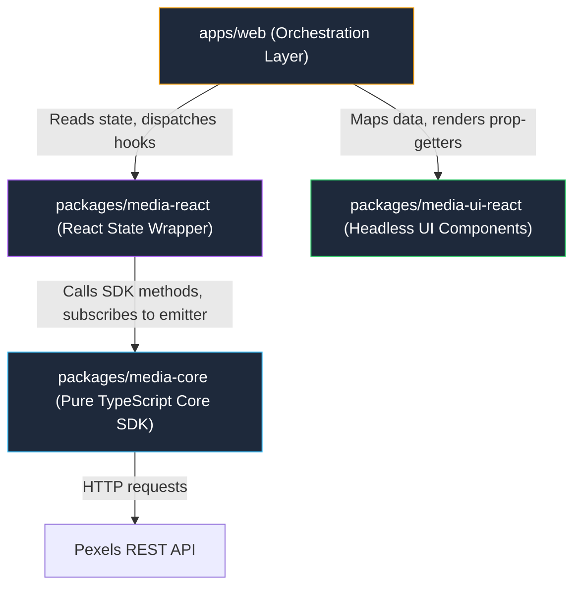

# NexusMedia — Headless SDK Engine

A production-grade, headless media SDK ecosystem built on top of the Pexels API using a monorepo architecture (`pnpm` workspaces + TypeScript strict mode).

---

## Architecture Overview



### Strict Architectural Boundaries

1. **`media-core`**: Pure TypeScript. ZERO React, ZERO DOM dependencies. Encapsulates Pexels API fetching, API key closure protection, in-memory caching/request de-duplication, pub/sub event emission, and `Result<T>` error unions.
2. **`media-react`**: Thin React wrapper. Converts `media-core` calls into React state via `<MediaProvider>` and hooks (`usePhotoSearch`, `useVideoSearch`, `useMediaItem`, `useMediaEvent`, `useMediaTracking`). Re-exports core types so consumer apps never import `media-core` directly.
3. **`media-ui-react`**: Headless React UI library (`useGrid`, `useLightbox`, `useReelSwiper`). Ships **ZERO CSS**, **ZERO imports from `media-core`**, and **ZERO imports from `media-react`**. Operates strictly on a local, SDK-agnostic `MediaItem` interface.
4. **`apps/web`**: The single orchestration application. It is the **ONLY** package allowed to import both `@media-sdk/react` and `@media-sdk/ui-react` to wire data to display.

> ⚠️ **Boundary Enforcements**:
> - `media-react` and `media-ui-react` **NEVER** import each other.
> - `media-ui-react` **NEVER** imports `media-core`.
> - Application components **NEVER** import `media-core` directly.

---

## Setup & Local Development

### Prerequisites

- **Node.js**: `>= 18.0.0`
- **pnpm**: `>= 8.0.0`

### Installation

```bash
# Clone the repository
git clone <repository-url>
cd <repository-folder>

# Install all workspace dependencies
pnpm install

# Build all workspace packages in dependency order
pnpm -r build
```

### Environment Setup

Create an `.env` file in `apps/web/.env`:

```env
VITE_PEXELS_API_KEY=your_pexels_api_key_here
```

### Running Packages & Applications

```bash
# Start the web app dev server (apps/web)
pnpm dev

# Typecheck all workspace packages
pnpm typecheck

# Build static API documentation site via TypeDoc
pnpm docs
```

---

## What Was Cut and Why (Engineering Tradeoffs)

1. **React Native Stubs (`media-native`, `media-ui-native`)**:
   - *Decision*: Scaffolded `package.json` and `README.md` stubs explaining the contract.
   - *Rationale*: Scoped out due to interview time constraints. The contract is designed to mirror `media-react` and `media-ui-react`, demonstrating monorepo multi-target architecture without duplicating implementation overhead.

2. **Lightbox Video Player Custom Controls**:
   - *Decision*: The `useLightbox` hook manages full navigation and state for both photos and videos, but defers video player rendering to the consumer via `renderContent`.
   - *Rationale*: Custom video playback controls (custom scrubbers, volume sliders, HLS streaming) introduce heavy UI opinion. Deferring video rendering to the consumer preserves the strict "zero shipped CSS / headless" contract while keeping the Lightbox focused on accessibility, focus trapping, and keyboard navigation.

3. **Lazy Cache Eviction vs. Background Timers in `media-core`**:
   - *Decision*: Cache TTL (5 minutes) uses lazy check-on-read eviction instead of `setInterval` timers.
   - *Rationale*: Active background interval timers in JS libraries create memory leak risks in short-lived environments (CLI scripts, SSR request handlers, unit tests). Lazy eviction is deterministic, side-effect free, and zero-overhead.

---

## AI Tool Usage

### Generation vs. Review Breakdown

| Package | Primary AI Tools | AI-Generated Scope | Hand-Edited / Architected Scope |
|---|---|---|---|
| `media-core` | Gemini 3.1 Pro / Claude 3.6 | Initial Pexels API type definitions, basic error factory functions. | Refactored API key closure protection, pub/sub emitter error isolation, lazy cache key sorting, discriminated union `Result<T>` design. |
| `media-react` | Gemini 3.6 Flash / Claude 3.6 | Hook scaffolding and JSDoc comment blocks. | Designed `useAsyncState` generic mapper, refactored `usePhotoSearch`/`useVideoSearch` pagination refs, handler ref pattern in `useMediaEvent`. |
| `media-ui-react` | Gemini 3.6 Flash / Claude 3.6 | Basic HTML attribute types and boilerplate JSX components. | Architected prop-getter merging utility (`mergeProps`), focus trap + keyboard handler in `useLightbox`, IntersectionObserver callback ref in `useGrid`. |
| `apps/web` | Gemini 3.6 Flash | Layout CSS styling, basic HTML structures. | Integrated `ActivityLog` subscriber, wired `PhotoGridView` and `VideoReelView` mapping functions, verified zero-SDK-import rules in UI layer. |

### Skill Document Verification & Testing

Two SKILL.md documents were authored to guide AI coding assistants:
- [`skills/wiring-media-data/SKILL.md`](file:///d:/My%20Projects/New%20folder/skills/wiring-media-data/SKILL.md): Teaches proper consumption of `@media-sdk/react`.
- [`skills/using-media-components/SKILL.md`](file:///d:/My%20Projects/New%20folder/skills/using-media-components/SKILL.md): Teaches consumption of `@media-sdk/ui-react` prop-getters and BYO-styling rules.

**Validation Methodology (A/B Test)**:
1. **Control Run (Without Skill)**: Prompted a fresh AI agent to build a Pexels search grid component. The agent violated boundaries by importing `@media-sdk/core` directly, instantiating `createMediaClient` inside the component, and hardcoding inline styles.
2. **Treatment Run (With Skill Loaded)**: Prompted with the same instructions while `wiring-media-data` and `using-media-components` skills were active. The agent correctly imported exclusively from `@media-sdk/react`, mapped data to local `MediaItem` types, and used prop-getters with external Tailwind CSS classes.

---

## Project Links

- **GitHub Repository**: `https://github.com/username/media-sdk-ecosystem` *(Placeholder)*
- **Live Demo Web App**: `https://media-sdk-demo.vercel.app` *(Placeholder)*
- **Core SDK API Docs (TypeDoc)**: `https://media-sdk-docs.vercel.app/core` *(Placeholder)*
- **Headless UI Components Docs**: `https://media-sdk-docs.vercel.app/ui` *(Placeholder)*
- **AI Agent Trajectory / Transcripts**: `https://github.com/username/media-sdk-ecosystem/tree/main/logs` *(Placeholder)*
